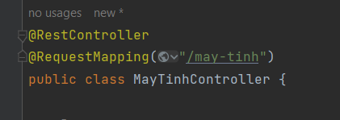

# TRANNING SPB GĐ1

**1. @RestController vs @Controller**
- Trong File MayTinhController chứa annotation của Spring Framwork
 



+ `@Controller` : được sử dụng để đánh dấu một lớp là một controller trong ứng dụng Spring MVC truyền thống. Các phương thức trong lớp được đánh dấu với các annotation @RequestMapping, @GetMapping, @PostMapping,... để xác định các endpoint mà controller đó xử lý.
```java
@Controller
public class HelloController {
    
    @GetMapping("/hello")
    public String hello(Model model) {
        model.addAttribute("message", "Hello, world!");
        return "hello";
    }
    
}

```
+ `@RestController`: cũng được sử dụng để đánh dấu một lớp là một controller trong Spring Framework, tuy nhiên, khác với @Controller, @RestController tự động thêm @ResponseBody cho các phương thức trong lớp đó. Điều này có nghĩa là, các phương thức trong lớp được đánh dấu bởi @RestController trả về các đối tượng dữ liệu thay vì trang HTML, JSON hoặc XML.
 ```java
@RestController
public class HelloRestController {
    
    @GetMapping("/hello")
    public String hello() {
        return "Hello, world!";
    }
    
}

```
=> @Controller và @RestController đều có thể được sử dụng để xác định một controller trong Spring Framework, tuy nhiên, @RestController là một phiên bản đặc biệt của @Controller được sử dụng để trả về dữ liệu thay vì trang HTML.

**2. PUT POST GET DELETE PATCH (Mapping in Controller)**
- Trong Spring Boot, các annotation @GetMapping, @PostMapping, @PutMapping, @DeleteMapping, và @PatchMapping được sử dụng để ánh xạ các request HTTP GET, POST, PUT, DELETE, và PATCH tương ứng.

Các phương thức khác nhau sẽ được sử dụng tùy thuộc vào kiểu request HTTP mà client gửi đến server:

+ `@GetMapping`: được sử dụng để ánh xạ các request HTTP GET và trả về các resource được yêu cầu từ server.
 

+` @PostMapping`: được sử dụng để ánh xạ các request HTTP POST và thường được sử dụng để tạo mới một resource.


+ `@PutMapping`: được sử dụng để ánh xạ các request HTTP PUT và thường được sử dụng để cập nhật một resource.


+ `@DeleteMapping`: được sử dụng để ánh xạ các request HTTP DELETE và thường được sử dụng để xóa một resource.


+ `@PatchMapping`: được sử dụng để ánh xạ các request HTTP PATCH và thường được sử dụng để cập nhật một phần của một resource.

**3. Sử dụng @Autowired @Service @Controller**
   https://www.tutorialspoint.com/spring_boot/spring_boot_service_components.htm
   - @Autowired được sử dụng trong Spring Framework để tự động liên kết các phụ thuộc (dependencies) của một bean với các bean khác. Khi một bean được khởi tạo, Spring sẽ tự động tìm kiếm các phụ thuộc của nó và cung cấp chúng cho bean.
Trong đoạn code trên, @Autowired được sử dụng để tự động liên kết MayTinhService với MayTinhController. Điều này cho phép MayTinhController sử dụng các phương thức của MayTinhService mà không cần phải tạo đối tượng mới của nó.

**3.1 : Cơ Chế Dependency Injection (DI) và Inverse of Control (IoC)**

**3.2 : Sử dụng các stereotype annotations:**

- Trong Spring Framework, các stereotype annotations như @Component, @Service, @Repository, @Controller và @Configuration đều là các annotation được sử dụng để đánh dấu class của một bean. Tuy nhiên, mỗi annotation được sử dụng để đánh dấu các class khác nhau trong một ứng dụng.

  - @Component:
  @Component là một annotation cơ bản nhất trong số các stereotype annotations. Nó được sử dụng để đánh dấu một class là một Spring Bean và cho phép Spring quản lý các instance của class đó. @Component thường được sử dụng cho các class không rõ ràng thuộc về lớp nào trong hệ thống.
 

  - @Service:
  @Service là một annotation được sử dụng để đánh dấu các class là một Spring Service. @Service thường được sử dụng cho các class đảm nhận các chức năng nghiệp vụ.


  - @Repository:
  @Repository là một annotation được sử dụng để đánh dấu các class là một Spring Data Repository. @Repository thường được sử dụng cho các class tương tác với cơ sở dữ liệu, đặc biệt là khi sử dụng Spring Data.


  - @Controller:
  @Controller là một annotation được sử dụng để đánh dấu các class là một Spring Controller. @Controller thường được sử dụng cho các class đảm nhận các chức năng điều hướng trong Spring MVC.


  - @Configuration:
  @Configuration là một annotation được sử dụng để đánh dấu các class là một Spring Configuration. @Configuration thường được sử dụng để cấu hình các Bean và các thành phần khác của ứng dụng. Các class được đánh dấu bằng @Configuration thường chứa các phương thức được đánh dấu bằng @Bean để tạo ra các Bean trong ứng dụng.

**4. Model/ Page**
- Model là một interface và được implement bởi class ExtendedModelMap. Nó cung cấp các phương thức để thêm, xóa và truy xuất các thuộc tính của một đối tượng. Khi một đối tượng Model được truyền vào phương thức của một Controller, nó sẽ được Spring tự động tạo ra và cung cấp cho Controller đó.
```java
 @GetMapping("/detail/{ma}")
    public String detail(@PathVariable("ma") UUID ma, Model model) {
        MayTinhs mayTinhs =  mayTinhService.findById(ma);
        Page<MayTinhs> listMayTinh = mayTinhService.getList(0);
        model.addAttribute("mayTinh", mayTinhs);
        model.addAttribute("mayTinhRequest", new MayTinhRequest());
        model.addAttribute("listMayTinh", listMayTinh);
        return "index";
    }
```
Trong Spring Boot, đối tượng Page được sử dụng để lưu trữ một trang (page) dữ liệu, thường được sử dụng để phân trang (pagination) dữ liệu trong các ứng dụng web.

**5. @PathVariable @ModelAttribute @RequestParam....1 số loại khác**
- @RequestParam, @PathVariable và @ModelAttribute là những annotation trong Spring Framework được sử dụng để trích xuất giá trị từ request và truyền vào cho các phương thức xử lý yêu cầu (request) HTTP.

   - @RequestParam: được sử dụng để trích xuất giá trị của một tham số được truyền lên trong request dưới dạng query parameter hoặc form data. Ví dụ: http://example.com/path?name=value, giá trị của tham số name có thể được trích xuất bằng cách sử dụng @RequestParam("name").


   - @PathVariable: được sử dụng để trích xuất giá trị của một biến được đính kèm vào URL. Ví dụ: http://example.com/path/{id}, giá trị của biến id có thể được trích xuất bằng cách sử dụng @PathVariable("id").


   - @ModelAttribute: được sử dụng để trích xuất giá trị của các tham số được đính kèm vào form data và truyền vào một đối tượng (object) được chỉ định. Các giá trị được trích xuất từ form data được gán vào các thuộc tính của đối tượng được chỉ định. Ví dụ: @ModelAttribute("user") User user, trong đó User là một lớp đại diện cho đối tượng user.

- Ngoài @RequestParam, @PathVariable và @ModelAttribute, trong Spring Framework còn một số annotation khác để xử lý các trường hợp khác nhau như:

  `@RequestBody`: 
   - Chỉ định đối tượng được gửi lên trong request body sẽ được gán cho tham số được chú thích bởi annotation này.

  `@RequestHeader`: 
  - Chỉ định giá trị của header trong request sẽ được gán cho tham số được chú thích bởi annotation này.

  `@ResponseBody`: 
  - Chỉ định phương thức hoặc trả về giá trị của phương thức được trả về như là phản hồi HTTP, thay vì sử dụng View để hiển thị dữ liệu.

  `@SessionAttribute`:
  - Chỉ định một thuộc tính trong Session sẽ được gán cho tham số được chú thích bởi annotation này.

  ` @CookieValue`: 
  - Chỉ định giá trị của cookie sẽ được gán cho tham số được chú thích bởi annotation này.

=> Các annotation này đều giúp xử lý và truy cập dữ liệu trong request và response, giúp giảm thiểu việc lặp lại việc lấy dữ liệu và xử lý, tối ưu hóa mã nguồn và tăng tính bảo mật cho ứng dụng.

**6. JpaRepository<MayTinhs, UUID>??(Repository)**

- JpaRepository là một interface trong Spring Data JPA được sử dụng để thao tác với cơ sở dữ liệu bằng cách cung cấp các phương thức đơn giản để thực hiện các thao tác CRUD (Create, Read, Update, Delete).

- `JpaRepository<T, ID>`: là một interface với hai tham số kiểu dữ liệu, T là kiểu dữ liệu của entity (đối tượng) cần thao tác, ID là kiểu dữ liệu của khóa chính của entity đó.
Ví dụ: Trong ứng dụng Spring Boot, để thực hiện các thao tác CRUD trên một entity MayTinhs, bạn có thể tạo ra một interface MayTinhsRepository kế thừa từ JpaRepository<MayTinhs, UUID>:
  ```java 
  public interface MayTinhsRepository extends JpaRepository<MayTinhs, UUID> {
  // Các phương thức tương ứng với các thao tác CRUD sẽ được kế thừa từ JpaRepository
  }
  ```
  - Khi bạn sử dụng JpaRepository, bạn không cần phải viết các truy vấn SQL thủ công để thực hiện các thao tác CRUD, mà thay vào đó, bạn có thể sử dụng các phương thức được cung cấp sẵn trong JpaRepository để thực hiện các thao tác này. Ví dụ:

    `findAll()`: Lấy tất cả các entity trong cơ sở dữ liệu.
  
    `findById(ID id)`: Lấy entity với khóa chính là id.
  
    `save(T entity)`: Lưu một entity mới vào cơ sở dữ liệu hoặc cập nhật entity đã có.
    
    `delete(T entity)`: Xóa một entity khỏi cơ sở dữ liệu.
  Với JpaRepository, việc thao tác với cơ sở dữ liệu trở nên đơn giản và nhanh chóng hơn, giúp bạn tiết kiệm thời gian và năng lực khi phát triển ứng dụng.

**7. MayTinhRequest làm j**

**8. BeanUtils.copyProperties**
```java
 public MayTinhs update(UUID ma, MayTinhRequest request) {
        Optional<MayTinhs> mayTinhs = mayTinhRepository.findById(ma);
        BeanUtils.copyProperties(request, mayTinhs.get());
        return mayTinhRepository.save(mayTinhs.get());
    } 
```
- `BeanUtils.copyProperties` là một phương thức trong Spring Framework, được sử dụng để sao chép giá trị thuộc tính giữa các đối tượng Java. Nó thực hiện việc sao chép các giá trị thuộc tính từ đối tượng nguồn (source object) sang đối tượng đích (destination object) dựa trên các tên thuộc tính trùng nhau trong cả hai đối tượng.

Trong trường hợp này, `BeanUtils.copyProperties(request, mayTinhs.get())` được sử dụng để sao chép các giá trị thuộc tính từ đối tượng request của lớp MayTinhRequest sang đối tượng mayTinhs.get() của lớp MayTinhs.
Kết quả là các thuộc tính của đối tượng mayTinhs.get() sẽ được cập nhật bằng các giá trị tương ứng trong đối tượng request.

Việc sử dụng `BeanUtils.copyProperties` giúp rút ngắn đoạn mã và giảm thiểu việc phải thực hiện việc gán giá trị thuộc tính một cách thủ công, giúp mã nguồn trở nên dễ đọc và dễ bảo trì hơn.

**9. spring.mvc.view.prefix: /WEB-INF/views/  
  spring.mvc.view.suffix: .jsp**
- Trong Spring MVC, cấu hình `spring.mvc.view.prefix` và `spring.mvc.view.suffix` được sử dụng để xác định đường dẫn tiền tố và hậu tố của tất cả các tệp view.
- Khi một phương thức trong @Controller trả về một tên view, Spring MVC sẽ tự động thêm tiền tố và hậu tố vào tên view để xác định địa chỉ đầy đủ của tệp view.

  - Ví dụ: nếu `spring.mvc.view.prefix` được cấu hình là `/WEB-INF/views/` và `spring.mvc.view.suffix` được cấu hình là `.jsp`, 
  khi một phương thức trong @Controller trả về tên view là index, Spring MVC sẽ tự động tìm kiếm tệp view tại đường dẫn `/WEB-INF/views/index.jsp.`

Vì vậy, cấu hình này cho phép Spring MVC biết cách tìm kiếm các tệp view trong ứng dụng.

**10. request respone**

Trong một dự án Spring Boot, request và response là các thành phần quan trọng của việc xử lý các yêu cầu từ client và trả về kết quả tương ứng cho client. Chúng liên quan đến phần xử lý của các controller và service trong ứng dụng.

- Các request được gửi từ client tới server thông qua các phương thức HTTP như `GET, POST, PUT, DELETE`. Các controller trong ứng dụng sử dụng các annotation như `@RequestMapping, @GetMapping, @PostMapping, @PutMapping, @DeleteMapping` để xác định các phương thức xử lý request tương ứng với các phương thức HTTP tương ứng.

- Các response được trả về từ server tới client chứa kết quả của các xử lý được thực hiện trên request. Các controller xử lý các request và trả về kết quả thông qua các phương thức trả về một đối tượng ResponseEntity hoặc các kiểu dữ liệu khác như `String, List, Object`. Kết quả trả về được đưa vào response để gửi trả về cho client.


GIT: https://gist.github.com/nguyenvanhieuvn/d3e5e20c44ef9d565fa3d7b9ebabfc65#c%C3%A1ch-ch%C3%A8n-code
